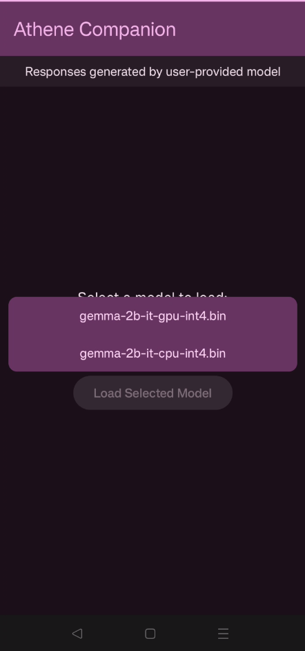
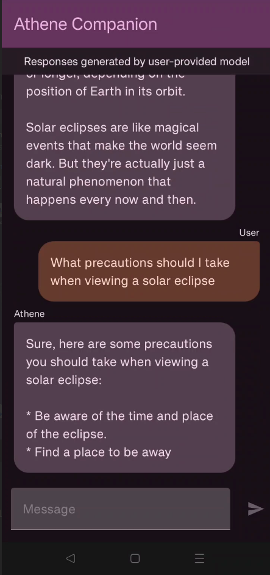

# Athene-Companion

### Overview

Athene Companion is an android app that helps users to communicate with On-Device Large Language Models using Google's LLM Inference API which makes communicating with local LLMs very easy 

This application must be run on a physical Android device to take advantage of the device GPU. (Please do not run it on an Emulator)

## Prototype Presentation

This **[youtube link](https://youtu.be/G90dqSncwT8)** takes you to the unlisted prototype presentation of Athene Companion.

## Run the prototype in your physical Android device

### Prerequisites

*   The **[Android Studio](https://developer.android.com/studio/index.html)**
    IDE.

*   A physical Android device with a minimum OS version of SDK 24 (Android 7.0 -
    Nougat) with developer mode enabled.

### Models Tested (On Device: OnePlus 8T)

1. gemma-2b-it-cpu-int4.bin (Tested :white_check_mark:)
2. gemma-2b-it-gpu-int4.bin (Tested :white_check_mark:)
3. Falcon-1B (Not yet tested)
4. StableLM-3B (Not yet tested)
5. Phi-2 (Not yet tested)

### Run the Application (if your device is Rooted)

*   Download any of the models from 
    **[compatible models](https://developers.google.com/mediapipe/solutions/genai/llm_inference#models)**. 
    
*   Remember to quantise the models if you are using any of the following models: 
    Phi-2, Falcon 1B or StableLM-3B. Gemma models do not need to be quantised but make sure 
    you select the TensorFlow Lite version under Model Variation in Kaggle.

*   Once you download it, place it under the path defined as modelPath in InferenceModel on 
    the Android device (eg. /data/local/tmp/llm/). You can use ZArchiver (An app from google playstore) to move the model from Download to the modelPath.

*   Download and install the beta version of Athene Companion from this github repository. It is
    located in the Beta-APK folder.

*   Athene Companion will automatically detect the LLM on your device.

*   Then just choose the model of your choice and chat away!

### Run the Application (if your device is NOT-Rooted)

*   Download any of the models from 
    **[compatible models](https://developers.google.com/mediapipe/solutions/genai/llm_inference#models)**. 
    
*   Remember to quantise the models if you are using any of the following models: 
    Phi-2, Falcon 1B or StableLM-3B. Gemma models do not need to be quantised but make sure 
    you select the TensorFlow Lite version under Model Variation in Kaggle.

*   Open Android Studio. Connect your Android device to Android Studio.

*   Upload the model into the correct modelPath (eg. /data/local/tmp/llm/) of your device 
    using Device Explorer in Android Studio.

*   Download and install the beta version of Athene Companion from this github repository. It is
    located in the Beta-APK folder.

*   Athene Companion will automatically detect the LLM on your device.

*   Then just choose the model of your choice and chat away!

*   For a step-by-step visual guide on this process (applicable only for non-rooted devices), 
    please refer to this **[tutorial video]()**.

## Contact

Jaid Monwar Chowdhury - [@jaid_monwar](https://www.facebook.com/jmc.unbesiegbar26/) - jaidmonwar.edu@gmail.com

Humayra Binte Monwar - [@humayra_monwar](https://www.facebook.com/) - humayramonwar@gmail.com